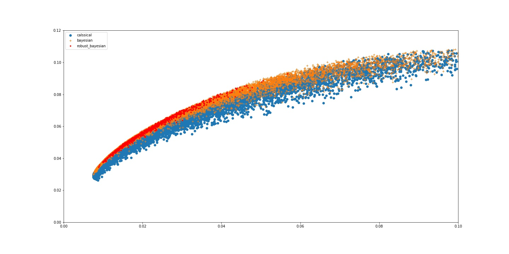

# Robust_Bayesian_Allocation

### Motivation

- Typically, asset allocation is a two-step approach: estimate market distribution (
, 
), and then perform optimization for asset allocation w.

- However, the second step is very sensitive due to input parameters (
, 
).

- In order to deal with this issue, robust method provides different approach for estimation risk by giving a uncertain range for parameter

- Bayesian approach is quite nature to identify a suitable uncertainty range for the market parameters 
, 
 (location-dispersion ellipsoid of the posterior distribution)

